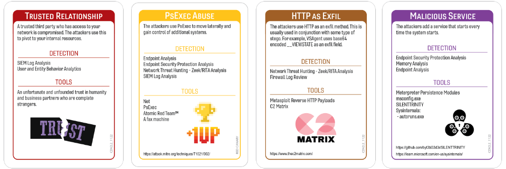
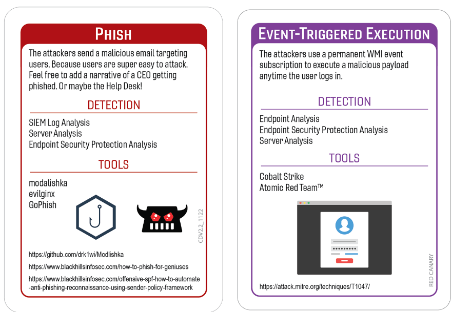

# Bullseye
### Author: Oliver Bebber - WGU BNB Lead Volunteer
#### Campaign Template v1 - Campaign Version - 1.0

In late 2013, cybercriminals gained unauthorized access to Target Corporation's computer network. They accomplished this by exploiting vulnerabilities in the network of a third-party HVAC vendor. Once inside Target's system, the attackers installed malware on the company's point-of-sale (POS) systems, allowing them to capture the credit and debit card information of millions of Target customers who made purchases during the holiday shopping season. Additionally, personal information, including names, addresses, email addresses, and phone numbers, of tens of millions of customers was also compromised.

The breach went undetected for several weeks, allowing exfiltration of large amounts of sensitive data. Target confirmed the breach in December 2013, sparking widespread concern among consumers and prompting investigations by law enforcement agencies and regulatory bodies. The fallout from the breach was significant, resulting in financial losses for Target, damage to its reputation, and legal repercussions. The incident highlighted the vulnerabilities in the retail industry's cybersecurity defenses and underscored the need for stronger data protection measures, including improved network security, threat detection capabilities, and vendor risk management practices.

## Tags
Red Canary Expansion Deck, Media Crisis, PII, PCI

## Compatible Decks
Red Canary Expansion

## Scenarios

### Initial Compromise

*Trusted Relationship & Phish*

The Target breach was caused by one of their third-party vendors, Fazio Mechanical - a refrigeration contractor, becoming compromised through a phishing campaign. 

### Pivot & Escalate

*PSExec Abuse*

The attackers behind the Target data breach moved laterally to gain access to Target's internal network. There were many tools discovered, one of which was PsExec, which can be used to install & launch programs remotely.

### C2 & Exfil

*HTTP as Exfil*

Due to Target's POS system being offline for PCI Compliance requirements, the attackers had to complete multiple steps before they could exfiltrate cardholder data. First, in combination with the trojan they installed on Target's POS systems, they were able to collect the cardholder's data after the card was swiped. This data would be sent to a dump server over a temporary NetBIOS share before being sent to the attacker's remote server. In order for the data to be sent to the remote server, a specially crafted ping packet would be sent to it first, notifying the server the data was available. The cardholder data would then be sent using the File Transfer Protocol (FTP). 

### Persistence

*Malicious Service*

Fazio Mechanical experienced a phishing campaign where the bad actor impersonated Fazio employees. This phishing campaign successfully allowed the bad actor to install a banking trojan, known as Citadel, on Fazio computers. If Fazio Mechanical had been using an enterprise anti-malware solution at the time of this breach, they would have been alerted to the trojan's presence. However, the company was using the free version of Malwarebytes which did not offer real-time protection. This trojan was able to gather login information used by Fazio employees, including the login information used to connect to Target's internal network.

*Event-Triggered Execution*

Additionally, the threat actors behind this breach were able to successfully install another piece of malware, known as Trojan.POSRAM, on Target's POS system. This trojan allowed the collection of cardholder data when cards were swiped by customers and would check to see if the local time was between 10am and 5pm every 7 hours before sending information to a dump server. 

## Procedures that Reveal the Attack Chain
The below Procedure Cards will reveal part of the attack chain in this scenario. This section can be used by the Incident Captain to quickly check if the card played would discover part of the attack chain. 

* User and Entity Behavior Analytics
	* Initial Compromise - Trusted Relationship
* Memory Analysis
	* Persistence - Malicious Service
* Server Analysis
    * Initial Compromise - Phish
    * Persistence - Event-Triggered Execution
* SIEM Log Analysis
	* Initial Compromise - Trusted Relationship
    * Initial Compromise - Phish
    * Pivot & Escalate - PsExec Abuse
* Network Threat Hunting
	* Pivot & Escalate - PsExec Abuse
    * C2 & Exfil - HTTP as Exfil
* Firewall Log Review
	* C2 & Exfil - HTTP as Exfil
* Endpoint Analysis
	* Persistence - Event-Triggered Execution
    * Persistence - Malicious Service
* Endpoint Security Protection Analysis
    * Initial Compromise - Phish
    * Pivot & Escalate - PsExec Abuse
	* Persistence - Event-Triggered Execution
    * Persistence - Malicious Service

## Written Procedures
Below are the four written procedures the team playing will receive as part of the incident. Written Procedures are chosen because they were specifically mentioned in some public disclosure about the breach this campaign was based on. If there no procedures mentioned being used during the incident the campaign is based on, then two procedure cards that will discover some part of the attack chain will be chosen and two procedures that will not discover some part of the attack chain will be chosen. For this campaign the below procedures will receive the +3 bonus per roll. As a general rule in campaign scenarios we select two established procedures that will discover part of the attack chain and two that will not for the +3 bonus.  

* Endpoint Security Protection Analysis
	* This was included because it will discover the Pivot & Escalate method for this campaign. It was also chosen because if Target's POS systems had endpoint security protection solutions in place, the rogue process "trojan.POSRAM" would have been detected and an alert dispatched to security analysts for further investigation. 

* Security Information and Event Management (SIEM) Log Analysis
	* This was included because it will discover the Pivot & Escalate method for this campaign. It was also chosen because during the Target breach, the attackers installed several tools as services to help them move laterally through the network and utilize admin credentials and commands to maintain persistence.

* Isolation
	* This card was included because it does not discover any items in the attack chain. In the case of the Target breach, the attack was carried out across all POS systems in all Target stores at the same time. Isolating one POS system, or even one store, would not have stopped the data exfiltration. 

* Physical Security Review
	* This card was included because it does not discover any items in the attack chain. In the case of the Target breach, the attack was carried out remotely from a third-party vendor using their remote access credentials. 

## Procedure Success

When the team chooses a Procedure that would reveal part of the attack chain and rolls successfully, the Incident Captain needs to explain what they discovered and why. Below are examples that may be used to describe why a procedure was successful and how the revealed part of the attack relates to the scenario. 

* UEBA (User and Entity Behavior Analytics)
	* Upon reviewing UEBA alerts, you discover connections from unknown/untrusted IP addresses using the credentials of the "trusted relationship" established with a third-party vendor. This would indicate a third-party compromise.
* SIEM Log Analysis
	* A security analyst reviewed the logs from the SIEM and discovered abnormal log entries that were inconsistent with the established baselines. This would indicate potential unauthorized traffic and some insight about an attacker and their attack chain.
* Network Threat Hunting
	* The Incident Response Team performed a review of firewall logs, NetFlow, and packet captures. After reviewing the activity, they noticed the traffic didn't align with the previously reviewed logs, revealing part of the attack chain.
* Firewall Log Review
	* While responding to the incident, the team identified logs showing connections to a Russian file server. This revealed part of the attack chain as it indicated a compromised system and active data exfiltration. 
* Endpoint Analysis
	* The Incident Response Team used tools to review POS systems that showed connections with a central dump server on regular schedule. This activity indicates a potentially malicious scheduled action or service running on the POS systems, revealing part of the attack chain.
* Endpoint Security Protection Analysis
	* The Incident Response Team used tools to review security logs on POS systems connecting to the central dump server. This activity indicated the creation/installation of the malicious service and its log of previous executions, revealing part of the attack chain.
* Memory Analysis
    * A Forensic Analyst reviewed the POS systems and discovered the trojan that was installed and how it was communicating with the central dump server. This revealed part of the attack chain.

## Procedure Failures
This section captures potential reasons why a control or procedure may fail. Below you will find general reasons for procedure failures related to the incident. You will also find specific reasons for a failure where a procedure card would discover part of the attack chain for the campaign. 

**General Reasons**

* Technical
	* "VarProcedure didn't detect anything because the attacker changed TTPs (Tactics, Techniques, Procedures)."
	* "VarProcedure didn't detect the attack because the agent or signatures are out of date."
	* "VarProcedure didn't detect the attack because the agent couldn't be deployed on the OS/Server/Laptop/Endpoint."
* Financial
	* "VarProcedure didn't work because the budget wasn't approved to expand licensing for tool/service/project/application to subsidiary/offices/data center/branch/new location/work from home/contractors."
	* "VarProcedure failed because the PO to renew the tool/service got stuck in the payment process. The tool/service stopped before someone noticed."
	* "VarProcedure couldn't identify any of the attack because the tool/service features that would have detected it were part of the more expensive package that wasn't purchased."
* Political
	* "VarProcedure wasn't configured at subsidiary/branch/business unit because Owner/VP/Senior Know-it-All/Project Manager said it would interfere with their CrItIcAl PrOjEcT timeline."
	* "VarProcedure found nothing because the project to deploy agent/service/tool/configuration was delayed until next fiscal year by the board."
	* "VarProcedure couldn't identify the attack because a member of the change board denied the change to deploy the service based on disagreements with the security team."
* Personnel
	* "The only person that knows how to do/use VarProcedure is Casey and they're on vacation."
	* "The contractor hired to deploy VarProcedure ran out of hours in their contract."
	* "The team that manages VarProcedure is away at a conference."

**Procedure Failure Reasons**

Below are examples of failure reasons for the cards that would discover part of the attack chain in this procedure. Specific examples are given for the cards that would have discovered parts of the attack chain because these are often the hardest to think of during game play. Keep in mind a procedure that would discover part of the attack chain may fail, but later the same procedure used may discover part of the attack chain. Attackers may have changed their Tactics, Techniques, or Procedures. A team member may have thought of a new search query. Maybe everyone got some sleep and came back with fresh eyes? 

It shouldn't have failed, but it did, and the Incident Captain needs to give a contextually reasonable answer as to why. The below can help facilitate those more difficult responses during game play. 
	
* UEBA (User and Entity Behavior Analytics)
	* Technical
		* "UEBA was deployed, but it doesn't look like the attacker performed any behaviors that are detected by the configuration. They may change tactics or we may need to review the configuration." 
	* Financial
		* "The solution that integrates the company's cloud environment to endpoints for analysis was an add-on which would have caused us to go over budget. Without meeting budget requirements, the solution wasn't installed."  
	* Political
		* "One of our teams experienced an outage when UEBA was installed. As a result, team members were unable to perform their normal job duties. The leader of the team blocked additional rollouts on the systems where UEBA could have detected the attack. Before we revisit this we can put in a change to deploy to those systems." 
	* Personnel
		* "Only one person knows how to configure the UEBA rules and is on vacation for two weeks. The team tried to configure the rules, but were unable to detect any part of the attack chain yet. Before we come back to this procedure, the team may contact vendor support or enlist professional services to tune the alerts." 
* SIEM Log Analysis
    * Technical
        * "Connectors for the systems that would generate alerts weren't fully configured. The connection was tested, but checking if rules generated alerts that would be sent to the SIEM was not. The team is correcting this issue. Once corrected they may begin to see logs that reveal part of the attack chain." 
    * Financial
        * "Additional licenses were needed to deploy to systems that came online after the original license purchase. The funding for these licenses was delayed until next quarter. The Incident Response Team was given approval to get the licenses and rapidly deploy them. Once deployed we may begin to see logs in the SIEM related to the attack chain." 
    * Political
        * "Infighting about who would own and manage the SIEM delayed deployment and configuration of functions that could have seen portions of the attack chain in logs. Management has cleared these roadblocks to allow the IR team to setup alerting and logging that may capture information that reveals part of the attack chain, but this will have to wait until we can look at the SIEM again." 
    * Personnel
    	* "The best threat hunter on your team is on vacation. They are an avid scuba diver that regularly travels to scuba camps on islands with little or no mobile phone reception. The Incident Response Team is doing their best to search the SIEM, but they aren't finding anything that would give clues about the attack chain yet. Give them time and maybe when we can look at the SIEM again."
* Network Threat Hunting
	* Technical
		* "Your threat hunters are hunting, but they discovered many of the logs they would like to review and network segments they want to look at live are unavailable to them. An Emergency Change was put in to get them logs and access they need, but it will take some time to configure. When we come back to threat hunting they may be more successful."
	* Financial
		*  "The project to configure telemetry used by the threat hunters to find active breaches on the network was scraped in this years budget. They're trying their best with the tools and access they have, but aren't finding anything that would reveal the attack chain yet. Management approved any tools or changes they need to speed up the process. Hopefully when we try threat hunting again they will see something that reveals the attack chain."
	* Political
		* "A board member was identified as an insider threat by one of the threat hunters. However, this one done in error. The threat hunter was justified in their analysis, but the board member was authorized perform the actions the threat hunter identified as a possible threat actor. The board member took this personally and asked for an investigation into how we perform threat hunting on the network before any other threat hunts are performed. This delayed the threat hunting process being part of daily operations. The threat hunters were given permission to start aggressively searching systems, but it will take them time to find anything. Hopefully they will find something the next time we try this procedure."
	* Personnel
		* "Your Lead Threat Hunter is on a plane traveling to another country to work on another potential breach at a data center where they must be onsite to perform the work. They will not see any messages or be able to perform any work for another eight hours. Hopefully when they land they can help the next time we try this procedure."
* Firewall Log Review
	* Technical
		* "The logging levels needed to identify the attack were configured to rollover every three days. The firewall will be reconfigured to capture logs on off device long term storage. Unfortunately, the logs that could reveal part of the attack chain are no longer available. Hopefully when we look at the logs again later and the attacker may leave a clue that will reveal part of the attack chain."
	* Financial
		* "Firewall logging functions were overwhelming performance so the level of detail captured per connection was reduced. This problem was to be corrected with the purchase of newer modern firewalls this quarter. Unfortunately, this line item was cut from the budget. The Executives expedited the purchase of an upgraded firewall and professional services to install it based on the breach. Hopefully by the next time we look at the procedure again the firewall will be installed and configured. At that point firewall logs may reveal part of the attack chain."
	* Political
		* "Deployment of firewalls on specific network segments caused an outage for part of the business. Executives from business units impacted demanded a full after action review and only once they were satisfied this would not happen again were the firewalls approved for redeployment. This is happening now. Hopefully by the next time we try this procedure they will be enabled."
	* Personnel
		* "Your firewall engineer is at a training event in a hotel conference room with zero phone reception and no public Internet service. They cannot be reached to give the Incident Response Team access to the look at firewall configuration. They will call back on their break. Hopefully the next time we look at the firewall review they will have granted access to the Incident Response Team that will allow them to reveal part of the attack chain."
* Endpoint Analysis
	* Technical
		* "The logs locally on the system were wiped. The Incident Response Team hardened the system to prevent this moving forward. Hopefully the next time we look at this procedure the attacker will perform an action on the local machine that creates a log revealing a clue about the attack chain."
	* Financial 
		* "The contractor hired to perform reviews and hardening of endpoints was released because the hardening project went over budget. The project wasn't completed and many systems aren't writing the logs needed for the Incident Response Team needs. This is being corrected now. Hopefully when you try the procedure again logs on the system will reveal something about the attack chain."
	* Political
		* "When hardening was deployed to executive laptops it caused a lot of friction. The executives complained and asked for a full review of the deployed hardening to ensure it doesn't impact business operations. This left many systems unhardened and without appropriate logging. As part of the Incident Response hardening will be rapidly deployed. Hopefully, the next time we look at this procedure we will find information that shows part of the attack chain."
	* Personnel
		* "The system needs to be physical inspected with hands on keyboard, but the closest person that can perform the work is several hours away by car. They've started driving, but it will take some time to get there. Once they will be able to look for clues about the attack chain."
* Endpoint Security Protection Analysis
	* Technical
		* "The agents that allow for remote inspection of endpoints hung after the last O/S update. The support team that manages endpoints is addressing the issue, but it will be a moment before the Incident Responders can look at the systems they need to review. The next time we try the procedure, hopefully, we will be able to connect to these systems and investigate."
	* Financial 
		* "When Endpoint Security Analysis was purchased a decision was made to only purchase agents for critical systems that process or store sensitive data. The attacker pivoted through systems that weren't configured for Endpoint Security Protection Analysis. The configuration changes are underway now to get this function online for these systems. The next time we try this procedure we may see clues about the attack chain."
	* Political
		* "An update to Endpoint Security Protection configuration or agents caused systems where this function is configured to go into a boot loop. The Change Committee denied changes to redeploy the function as they got in an argument with one of the IT leads about whether the issue would occur again. Management granted an Emergency Change Approval to reconfigure Endpoint Security Protection Analysis. The next time this procedure is used the team hopes some clues will be revealed about the attack."
	* Personnel
		* "The team member responsible for deploying the service never received proper training in configuration and did their best, but missed several key configurations. Further, they didn't have the skills to verify the procedure was accurate and complete or working as designed. The Incident Response Team is working with professional services to make the necessary changes. The goal is to potentially reveal some of the attack chain the next time we try the procedure."
* Memory Analysis
	* Technical
		* "The system doesn't have any remote forensic tools or connectivity that will let the security team install them. The system is also located in a data center the security team isn't physically near. Someone will need to go to that data center to install the tools before memory analysis can be completed successfully."
	* Financial
		* "The budget to hire a team member that really understood memory forensics and analysis was cut. The team can pull the memory and review it, but at the moment it's taking longer for them to figure out if there is something in the memory because they don't have the skill or training to do the proper analysis." 
	* Political
		* "The agents that do memory analysis for forensics were pulled when their installation crashed a critical set of systems. The IT leaders are pushing back on installing the tools again."
    * Personnel
        * "Only one analyst on the team is capable of navigating the forensic tools in our stack and they are currently on vacation for the next two weeks. We should have an additional analyst on the team to ensure availability in the event of another incident requiring memory analysis."

## Game Start

At the beginning of the game the Incident Captain shares how the team became aware of the incident:

"The federal government has contacted your company's leadership indicating a potential compromise. Your Legal Team/Execs/Security Leader informed you that this needs to be investigated immediately as cardholder data is at risk. Leadership wants the security team to determine whether this breach is legit, and if it is, how the company needs to proceed to stop it and prevent it from happening again."

## Game Conclusion

At the end of the game the incident captain should walk through the incident. The below is a description of what happened:

*The attacker successfully impersonated a third-party vendor's employee, gaining access to their systems and collecting legitimate user credentials. Using their systems to navigate into other organization's environments, they navigated laterally through a client's portal and systems, installing malicious services on their POS system to exfiltrate cardholder data.*

This is similar to what we know about the Target breach where millions of credit and debit card information was stolen. Target's POS systems were segmented record. This system should be limited to specific queries, however, the vulnerability allows attackers to make additional requests to the primary databases that allowed them to capture the data of every customer in the Equifax database. 

## Are you ready?

In this scenario we replicated a data breach close to what Target suffered in 2013. Is your organization ready? Here are some of the key questions and takeaways you may examine to see if your organization is prepared:

* Do you have a SIEM deployed? 
    * Have you tested it to determine if it would detect privileged and trusted accounts doing things outside their normal behaviors?
    * How does your team handle false positives and false negatives?
* Do you actively threat hunt on your network?
* How many third-party vendors do you have?
    * How do you decide which third-party vendors are worth taking the risk of working with them?
    * How many of these third-party vendors have access into your network?
    * Does your security team review third-party vendor's security audit reports before your organization establishes a relationship?
* Do you have the proper staff to handle an incident of this capacity?

## References
The below are references to the incident this campaign was based on. These are included to give the Incident Captain additional context and background information before starting. They can also be given to the players after the fact to review as they research findings from the game and how those findings could impact their organization. 

* A "Kill Chain" Analysis of the 2013 Target Data Breach
    * [https://www.commerce.senate.gov/services/files/24d3c229-4f2f-405d-b8db-a3a67f183883](https://www.commerce.senate.gov/services/files/24d3c229-4f2f-405d-b8db-a3a67f183883)
* Anatomy of the Target data breach: Missed opportunities and lessons learned
	* [https://www.zdnet.com/article/anatomy-of-the-target-data-breach-missed-opportunities-and-lessons-learned/](https://www.zdnet.com/article/anatomy-of-the-target-data-breach-missed-opportunities-and-lessons-learned/)
* What Retailers Need to learn from the Target Breach to Protect against Similar Attacks
	* [https://securityintelligence.com/target-breach-protect-against-similar-attacks-retailers/#.VMA24UfF-So](https://securityintelligence.com/target-breach-protect-against-similar-attacks-retailers/#.VMA24UfF-So)
* Inside a Targeted Point-of-Sale Data Breach
	* [https://krebsonsecurity.com/wp-content/uploads/2014/01/Inside-a-Targeted-Point-of-Sale-Data-Breach.pdf](https://krebsonsecurity.com/wp-content/uploads/2014/01/Inside-a-Targeted-Point-of-Sale-Data-Breach.pdf)